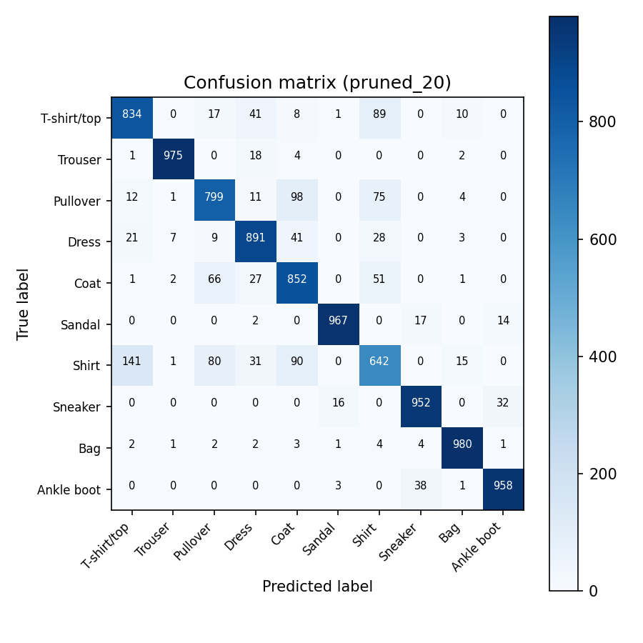

# Fashion-MNIST Model Compression

[](https://www.python.org/)
[](https://pytorch.org/)
[](https://github.com/zalandoresearch/fashion-mnist)

An experimental PyTorch pipeline comparing techniques for deploying convolutional neural networks on resource-constrained and IoT devices.

## Engineering question

How much model sparsity or numerical compression can be introduced before accuracy degrades enough to matter? The pipeline keeps the training and evaluation workflow consistent so pruning and quantization strategies can be compared on the same task.

## Experiments

- Baseline CNN training on Fashion-MNIST
- Global unstructured pruning at 20%, 50%, and 80% sparsity
- Fine-tuning after pruning
- Post-training static quantization
- Quantization-aware training
- Accuracy, size, and inference-performance comparison

## Run

```console
python -m venv .venv
pip install -r requirements.txt
python compress_fashionmnist.py --baseline-epochs 8 --fine-tune-epochs 2 --qat-epochs 4
```

For a quick pipeline check, set each epoch option to `1`.

## Results

Aggregate experiment metrics are available in [`experiment_summary.csv`](experiment_summary.csv).

| Method | Test accuracy | Sparsity |
| --- | ---: | ---: |
| Baseline float32 | 87.33% | 0% |
| Pruned 20% | **88.50%** | 20% |
| Pruned 50% | 88.26% | 50% |
| Pruned 80% | 87.91% | 80% |
| Static quantization | 87.33% | N/A |
| Quantization-aware training | 87.65% | N/A |

The experiment retained comparable accuracy even at high sparsity, while the 20% pruned model produced the best observed test accuracy. These results are specific to this training run and should not be generalized without repeated trials.



Model checkpoints and downloaded Fashion-MNIST data are excluded because they can be regenerated by the script.

## Course

CSCI 49000 AIT — Artificial Intelligence for IoT, Fall 2025.

## About the author

Built by **Ahmed Balde** as an edge-AI experiment in reproducible model evaluation. See more Python, AI/ML, data, and software-engineering work on [GitHub](https://github.com/fetachino).
